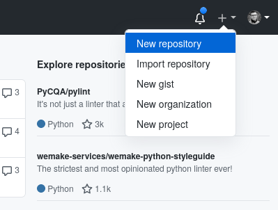
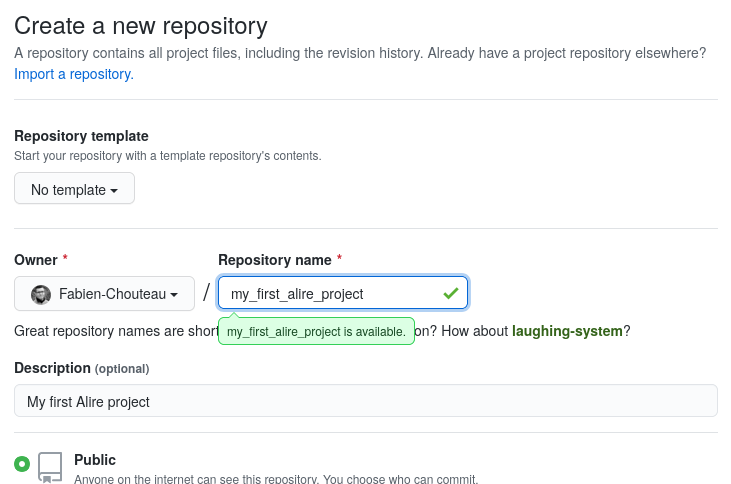
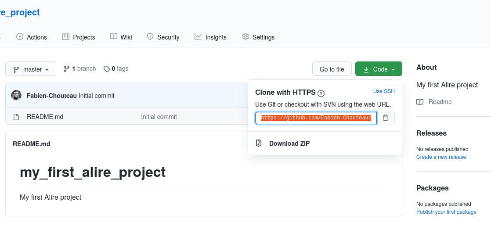

## Install Alire

You can get the latest `Alire` release at [alire.ada.dev](https://alire.ada.dev).

### On Linux and macOS

Extract the archive and add the `bin` directory to your `PATH`:
```shell
 $ export PATH=$PWD/bin:$PATH
```

### On Windows

An installer is available, it will install `Alire` and add a shortcut to your desktop.
The shortcut starts `PowerShell` with `alr` in the PATH.

## Install an Ada GNAT toolchain

You can download and install GNAT Community from https://www.adacore.com/download.

### On Linux

```shell
 $ wget https://community.download.adacore.com/v1/a639696a9fd3bdf0be21376cc2dc3129323cbe42?filename=gnat-2020-20200818-x86_64-linux-bin
 $ chmod +x gnat-2020-20200818-x86_64-linux-bin
 $ ./gnat-2020-20200818-x86_64-linux-bin
```
And then add the toolchain in `PATH`:
```powershell
$env:Path += ";C:\GNAT\2020\bin\"
```
### On Windows

In powershell:
```powershell
PS> (New-Object net.webclient).DownloadFile("https://community.download.adacore.com/v1/85091aafe5cb9463f1bfa20a53b6aa0931bf9fc2?filename=gnat-2020-20200818-x86_64-windows-bin.exe", "$pwd\gnat-2020-20200818-x86_64-windows-bin.exe")
PS> .\gnat-2020-20200818-x86_64-windows-bin.exe
```
And then add the toolchain in `PATH`:
```powershell
$env:Path += ";C:\GNAT\2020\bin\"
```
  
## Create a repository on GitHub





## Clone the repository



```shell
$ git clone https://github.com/<GITHUB_USER_NAME>/my_first_alire_project
```

## Initialize Alire crate (project)

## Build

## Edit the sources

## Run the application

## Add a dependency

## Edit the sources

## Prepare the crate for publishing

## Commit and push your changes

## Publish your crate
